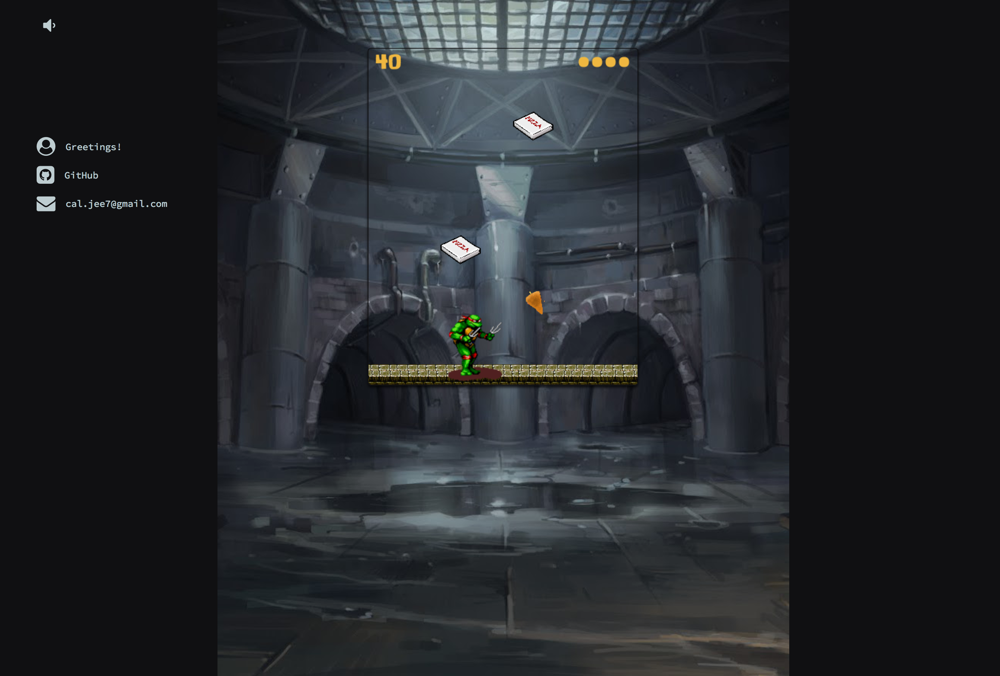

# Turtle NinZAAAA
A 2D browser game built in Vanilla JavaScript and HTML5 Canvas.

### Description
After a long night of fighting the Foot, the turtles are hungry for their favorite food. Luckily for them a pizza delivery guy had a bike accident right above their sewer and dropped a load of pizza boxes. Help the turtles slice up their pies so they can eat but avoid getting hit by them.

Good luck!

### Instructions
- Use the `left` and `right` arrow keys to move.
- Hit the `spacebar` to shoot the falling pizza boxes.
- Get 10 points for hitting the box and 10 for eating a pizza.
- Avoid getting hit by the pizza boxes, you have 4 lives.
- Miss any boxes and the platform will rise.
- Click the sound icon or press 'M' to mute.

### Technologies Used
- JavaScript
- HTML5 Canvas
- CSS

### Features to Come
- Power up items to break all the pizza boxes on screen.
- Extra points for hitting more than 1 box at a time.
- Increase difficulty with time.
- Turtles swap on death.
- Improved animations / sprites.
