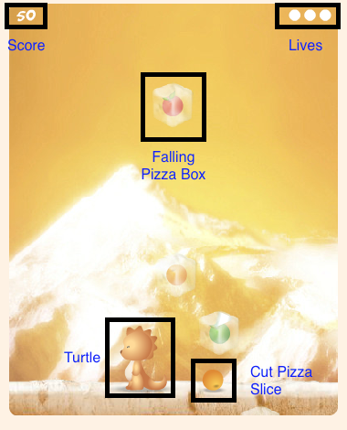

# Turtle NinZAAAA
Turtle NinZAAAA is an infinite run game based on the Teenage Mutant Ninja Turtles franchise.

### Description
After a long night of fighting the Foot, the turtles are hungry for their favorite food. Luckily for them a pizza delivery guy had a bike accident right above their sewer and dropped a load of pizza boxes. Help the turtles slice up their pies so they can eat but avoid getting hit by them.

### Features
- [ ] Access to mouse and arrow keys to maneuver
- [ ] Access to mouse-click and space to shoot shurikens
- [ ] Keep score based on how many pizzas sliced and collected
- [ ] Production README

### Wireframes
Turtle NinZAAAA will consist of a single page with the main game screen. The page will start with an intro to the game based on the TMNT theme. On click, the user will be guided to instructions on how to play. Once, the user is ready, the game will start. The page will include a footer with links to my Github, and Portfolio.  

### Technologies
This project will use the following technologies:
- Vanilla Javascript for game logic and jQuery for button inputs
- HTML5 Canvas for rendering and graphics
- Webpack to bundle and serve scripts
- Lightweight backend Firebase to keep track of high-scores

The following scripts will be needed:
- player.js to keep track of player movement and collisions with the pizzas
- platform.js to handle object rendering on the main game board
- obstacle.js this class will be the basis of the falling pizzas and creating the random patterns of gravity and placement

### Timeline
**Day 1** Setup html and css to render all non-canvas objects properly. Setup skeletons for js classes and learn canvas. Render player on screen and be able to move left and right with keyboard (and mouse).

**Day 2** Create falling pizza boxes and create collision logic with player. Add ability to shoot shurikens and hit pizza boxes to reveal pizzas.s

**Day 3** Add a scoring system and add the ability to save your high scores. Refine pattern of falling pizzas and polish up styling.

### Bonus Features
- [ ] Rising platform based on how many pizzas get by.
- [ ] Add special item to cut all pizza on the screen.
- [ ] Switching characters between the 4 turtles.
